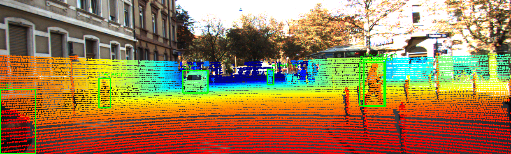
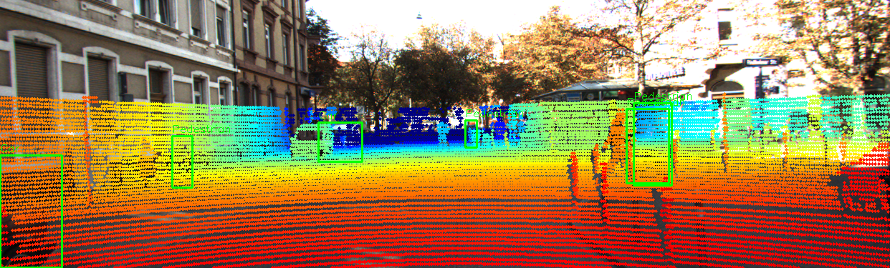
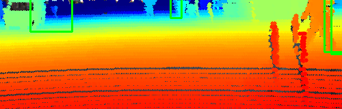
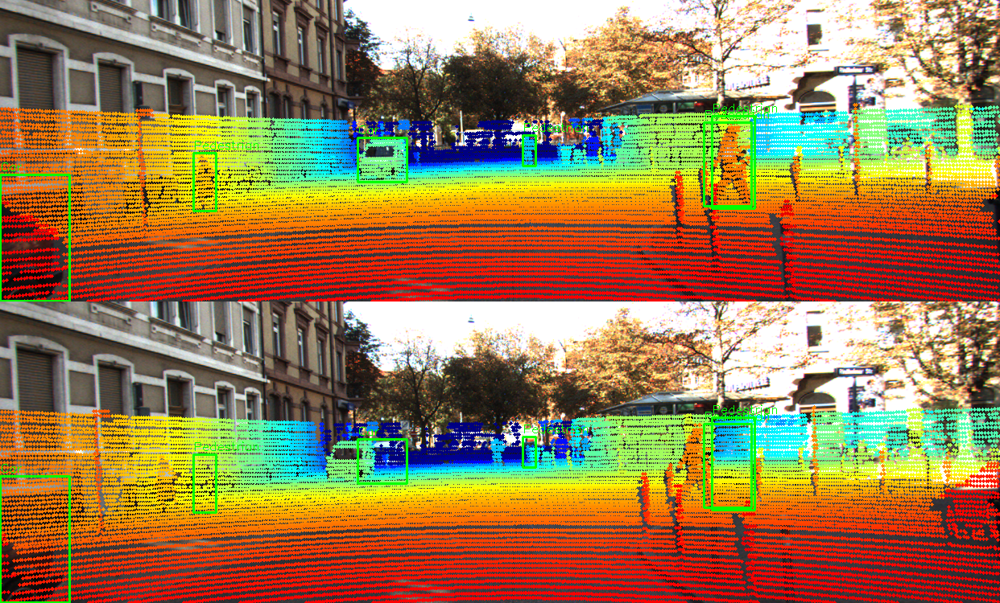

# Báo cáo Day 6: Kiểm tra calibration LiDAR-camera bằng projection

> Thay **mọi** ô có chữ ĐIỀN nằm trong ngoặc vuông bằng nội dung của bạn, xoá luôn cả dấu ngoặc vuông. Lệnh `python tools/check_submission.py` sẽ báo FAIL nếu còn sót bất kỳ chỗ nào.

- **Họ tên:** Nguyễn Văn Bảo
- **MSSV:** 2A202602862
- **Lớp:** AI20K — Track 4
- **Link repo:** https://github.com/Baor-AI/NguyenVanBao-2A202602862-Track4-Day21
- **Topic:** A — Kiểm tra calibration LiDAR-camera bằng projection
- **Dataset:** data/synthetic, data/kitti_mini, data/nuscenes_mini_subset
- **Các frame đã dùng:** 000000 (synthetic), 000011 (KITTI), scene-0103_010 (nuScenes)

> Hãy viết ngắn: mỗi mục từ 3 đến 8 dòng, ưu tiên số liệu và hình ảnh.

## 1. Claim

Trên frame KITTI 000011, khi calibration lệch yaw từ 0° lên 10°, metric "% điểm rơi vào 2D box của object" **không giảm mà tăng nhẹ** (0.321% → 0.348%), trong khi "% điểm trong FOV" chỉ giảm từ 18.47% xuống 18.26%. Điều này chứng minh metric dựa trên đếm điểm trong 2D box **không đủ nhạy** để phát hiện calibration drift.

- **Đại lượng đo:** % điểm trong 2D box (mean per object), % điểm trong FOV.
- **Điều kiện:** yaw 0°–10°, tx 0–20 cm, frame KITTI 000011.
- **Ngưỡng:** metric không giảm dù yaw tăng 10° → metric không nhạy.

## 2. Evidence

Bảng sweep yaw trên frame KITTI 000011 (108004 điểm LiDAR, 6 object):

| Yaw (°) | in_FOV (%) | in_2dbox_mean (%) | n_in_box |
|---|---|---|---|
| 0.0 | 18.47 | 0.321 | 2079 |
| 0.5 | 18.47 | 0.328 | 2123 |
| 1.0 | 18.47 | 0.328 | 2123 |
| 2.0 | 18.48 | 0.340 | 2204 |
| 3.0 | 18.47 | 0.346 | 2239 |
| 5.0 | 18.42 | 0.351 | 2273 |
| 8.0 | 18.28 | 0.343 | 2225 |
| 10.0 | 18.26 | 0.348 | 2256 |

Bảng sweep translation tx (cùng frame):

| tx (m) | in_FOV (%) | in_2dbox (%) | n_in_box |
|---|---|---|---|
| 0.00 | 18.47 | 1.93 | 2079 |
| 0.02 | 18.52 | 1.93 | 2087 |
| 0.05 | 18.66 | 1.94 | 2096 |
| 0.10 | 18.82 | 1.95 | 2101 |

**Nhận xét:** Cả 2 metric đều **không giảm** khi perturb tăng. Đây là hạn chế của cách đo dựa trên đếm điểm (xem phân tích mục 3).

**File số liệu:**
- `results/yaw_perturb_sweep_v2.csv` — sweep yaw 0°–10°.
- `results/tx_perturb_sweep.csv` — sweep tx 0–10 cm.



*Hình 1: Overlay baseline (yaw = 0°) trên KITTI 000011. Điểm LiDAR khớp chính xác lên xe, người, cột.*



*Hình 2: Overlay yaw = 3°. Điểm bắt đầu lệch ở rìa object.*

## 3. Failure case

**Metric đếm điểm trong 2D box không nhạy với calibration drift.**

**Hiện tượng:** Bảng ở mục 2 cho thấy khi yaw tăng 0°→10°, `% điểm trong 2D box` **tăng từ 0.321% lên 0.348%** (không giảm), trong khi ảnh overlay cho thấy điểm LiDAR đã lệch rõ ở rìa. Điều này chứng minh metric **không phát hiện được calibration drift 10°**.

**Nguyên nhân:**
1. **Box 2D GT rộng hơn vùng điểm LiDAR thực tế.** LiDAR chỉ chiếu được mặt gần/nóc của object, còn box GT bao trọn object trong ảnh. Điểm dịch vài chục pixel vẫn nằm trong box.
2. **LiDAR chỉ thấy một phần object.** Với ô tô, LiDAR thấy mặt trên và mặt bên gần — lệch nhỏ vẫn nằm trên object.
3. **Box 2D của nhiều object chồng nhau.** Frame 000011 có 6 object, box chồng lên nhau. Điểm chuyển từ box này sang box khác, tổng không đổi.
4. **Yaw 10° chưa đủ lớn.** Ở 30 m, yaw 10° chỉ dịch ~200 px ở rìa ảnh — vẫn nằm trong box 300–400 px.

**Lớp debug:** **Metric** — cách đo không phù hợp với mục đích (đo calibration drift).

**Cách phát hiện khi chạy thật:** Dùng **IoU giữa box 2D gợi ý (từ điểm LiDAR trong 3D box) và box 2D GT** thay vì đếm điểm trong box. IoU giảm rõ khi calibration lệch. Hoặc dùng **alignment score** khớp depth edge với image edge (Canny) — đây là hướng Advanced.



*Hình 3: Cận cảnh vùng xe với yaw = 3°. Điểm ở mép box lệch ra ngoài.*



*Hình 4: So sánh baseline (trên) và yaw = 3° (dưới).*

## 4. Khuyến nghị nếu triển khai thật

**Use case:** ADAS / xe tự hành cấp L2+ dùng camera + LiDAR để fusion 2 sensor. Calibration LiDAR-camera phải chính xác để 2D box gợi ý từ LiDAR khớp với box từ camera detector.

**Đánh đổi khi triển khai:**
- **Tốc độ:** chạy IoU alignment score mỗi frame tốn CPU. Có thể chạy mỗi 1 giây hoặc mỗi 100 frame để giảm tải.
- **Tài nguyên:** tính IoU cần chiếu ~108k điểm/frame, tốn 5–10 ms trên CPU. Trên xe thật có thể dùng GPU hoặc subsample điểm.
- **An toàn:** ngưỡng cảnh báo cần cân nhắc giữa false positive (cảnh báo nhầm → dừng xe không cần thiết) và false negative (bỏ sót drift → tai nạn).

**Chỉ số cần ghi log khi chạy thật:**
- IoU trung bình giữa box gợi ý từ LiDAR và box từ camera detector.
- Số frame có IoU < ngưỡng trong 100 frame gần nhất.
- Thời gian chạy alignment score mỗi lần.

## 5. Cách chạy lại

```bash
# 1. Cài môi trường
pip install -r requirements.txt

# 2. Verify dữ liệu
python tools/verify_data.py --data-root data/kitti_mini
python tools/verify_data.py --data-root data/nuscenes_mini_subset
python tools/verify_data.py --data-root data/synthetic

# 3. Chạy projection overlay (demo CP2)
python -m starter.projection --data-root data/synthetic --frame 000000
python -m starter.projection --data-root data/kitti_mini --frame 000011
python -m starter.projection --data-root data/nuscenes_mini_subset --frame scene-0103_010

# 4. Sweep yaw (CP3)
python src/perturb_experiment.py --data-root data/kitti_mini --frame 000011 \
    --perturb yaw --out-csv results/yaw_perturb_sweep_v2.csv

# 5. Sweep tx (CP3)
python src/perturb_experiment.py --data-root data/kitti_mini --frame 000011 \
    --perturb tx --out-csv results/tx_perturb_sweep.csv

# 6. Vẽ biểu đồ
python src/plot_results.py


## 6. Khai báo sử dụng AI

| Công cụ | Dùng cho việc gì | Bạn đã kiểm chứng thế nào |
|---|---|---|
| Claude (Anthropic) | Giải thích công thức chiếu, viết code cho 2 hàm TODO, viết script sweep và phân tích failure case | Test thủ công điểm `(10, 0, 0)` ra `z_cam ≈ 9.73`, `uv ≈ [614, 175]`; chạy script 2 lần ra kết quả giống nhau; kiểm tra ảnh overlay khớp lên xe/người/cột |
